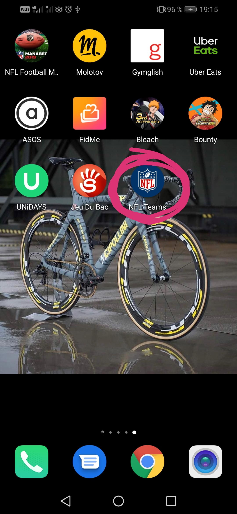
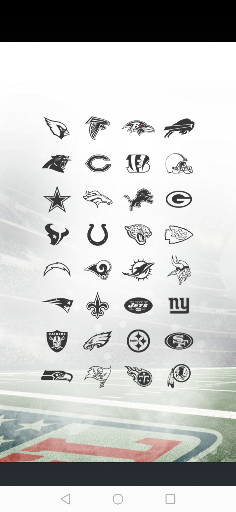
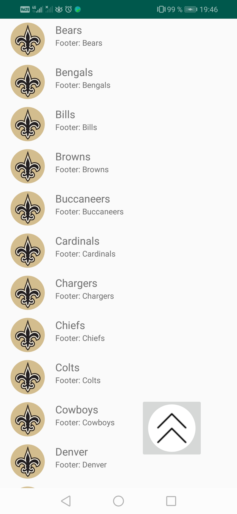
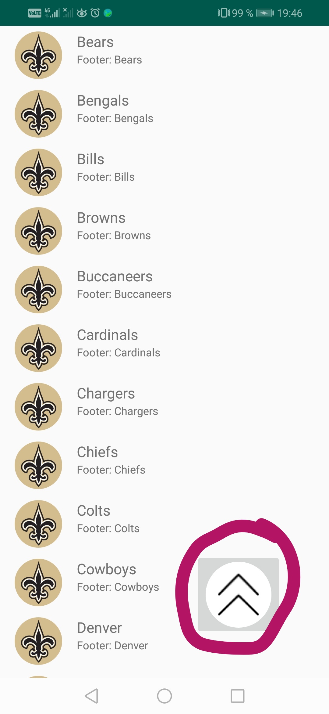

# NFLTeams
A mobile application using an API REST of NFL

## Présentation
Applcation android faisant un appel API de la NFL.
Cet API est issue de mon site héberger sur GitHub https://erdane.github.io/teams.json (que jai rédigé entierement)

## Prérequis
  - Récupérer la branche (master à vérifier) (mettre le lien de la branche)
  - Télécharger le fichier sur son mobile android : app-debug.apk 

## Consignes respectées :
  - 2 écrans : 2 activités
  - Appel WebService à une API Rest
  - Gitflow 
  - Architecture MVC
  - Fonctions supplémentaires :
    - SplashScreen
    - Boutton Back-to-top (pour remonter en haut de la page)
    
## Fonctionnalités 

### Menu home de mon téléphone
      - Icone de lancement de l'application

### SplashScreen
      - SplashScreen

### Première activité

### Seconde activité

### Fonctionalités
    - Back-to-top button, pour revenir au début de la page

